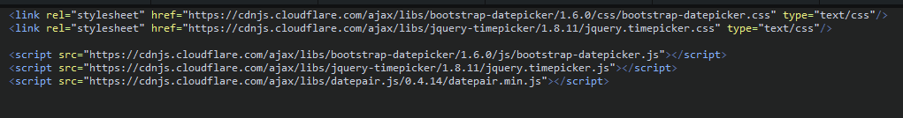
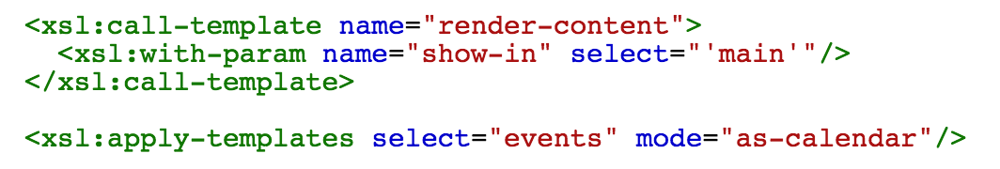
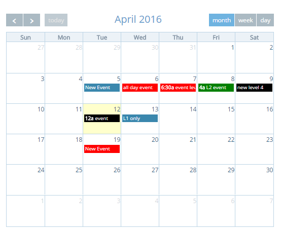

Events Calendar
===============

This extension provides an **events** node and creates a database table which is used to store events.

Also provides a calendar widget to dynamically display these events, create new events and edit existing ones.

Each event can be assigned to a certain level of access (1,2,3,4). A level of access is assigned to a user in webpal uder "Groups". If a user is a member of the group "Level 1", they will see only level 1 events. If a user is a member of the group "Level 2", they will see all events of both level 1 and 2. Same, for level 3 users and level 4 users, they will see all events that have a level less then or equal to the user's level.

Usage
-----

1. After importing the extension, reload the WebPal UI.
2. Make sure to include dtaepicker, timepicker and datepair in the template of your site. Use this code:

 <link rel="stylesheet" href="https://cdnjs.cloudflare.com/ajax/libs/bootstrap-datepicker/1.6.0/css/bootstrap-datepicker.css" type="text/css"/>  
 <link rel="stylesheet" href="https://cdnjs.cloudflare.com/ajax/libs/jquery-timepicker/1.8.11/jquery.timepicker.css" type="text/css"/>

   
   
 

1. Insert an **events** node into any page.
2. To render the calendar, apply templates for the events node, using mode **as-calendar**:
3. The calendar widget will show up as such:

4. Click on any date to add an event
5. Enter information in the dialog box and click save
6. To edit and event just click on it
7. In the week view you can drag and release to specify the start and end time of the new event, but they can be changed in the dialog box that will show up after releasing the mouse button.

